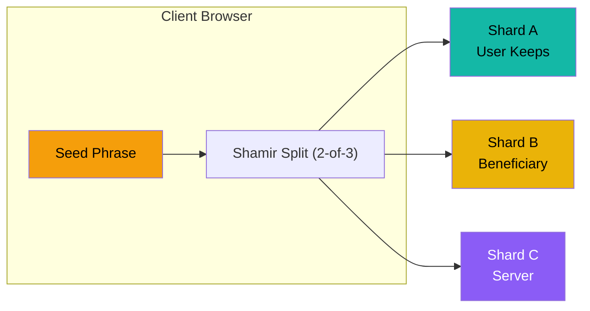
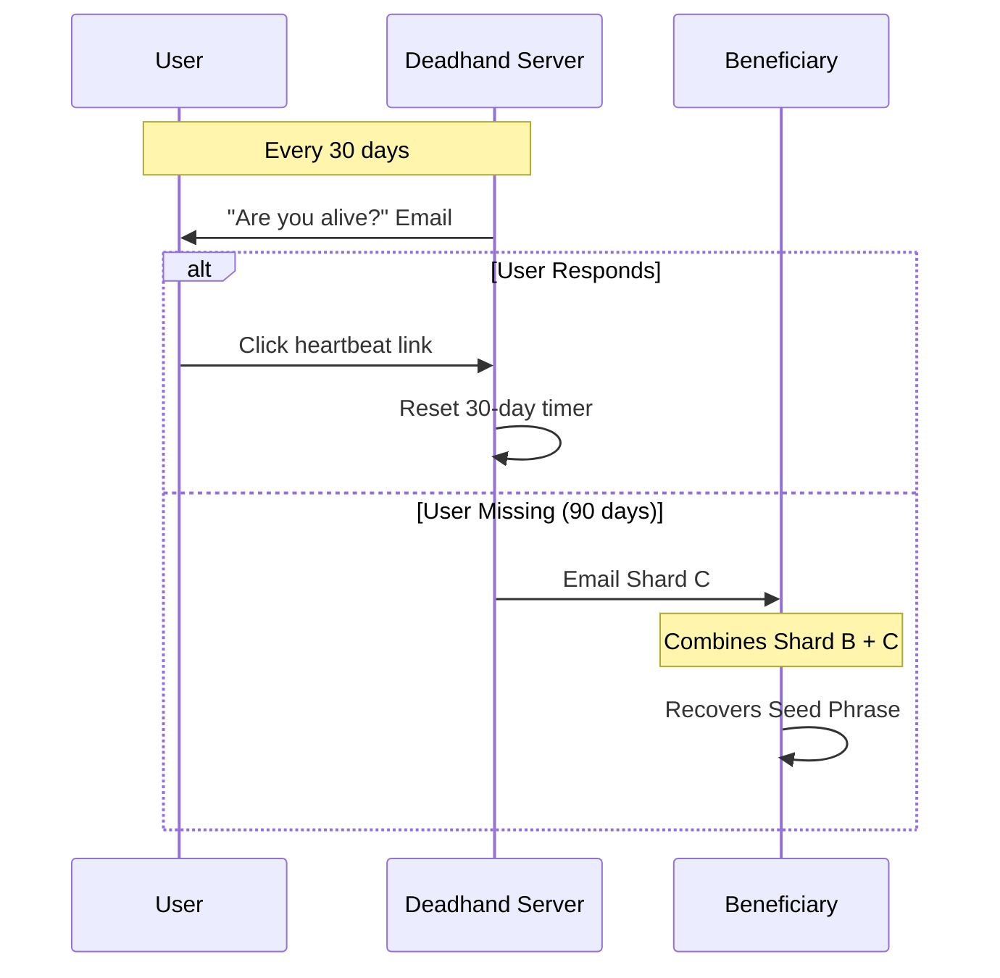
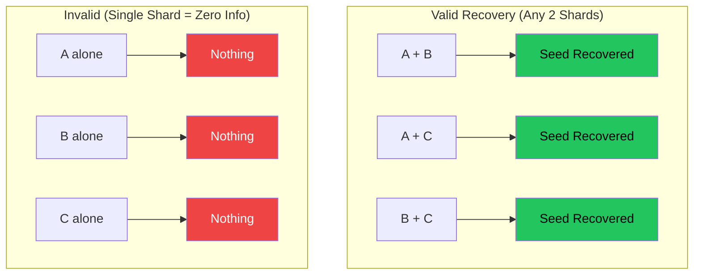

<p align="center">
  <a href="https://www.youtube.com/watch?v=YHouuGvPpd0">
    
  </a>
  <br>
  <em>▶️ Watch: What happens to your crypto when you die?</em>
</p>

# Deadhand

<p align="center">
  
  
  
  
  <br><br>
  <a href="https://deepwiki.com/pyoneerC/Deadhand"></a>
  <a href="https://www.shipit.buzz/products/dead?ref=badge" target="_blank"></a>
  <a href="https://www.producthunt.com/products/shardium?utm_source=badge-featured&utm_medium=badge&utm_campaign=badge-shardium" target="_blank"></a>
  <a href="https://korben.info/deadhand-testament-numerique-crypto-shamir.html" target="_blank"></a>
  <a href="https://habr.com/ru/news/988348/" target="_blank"></a>
</p>

### Trustless dead man's switch for crypto inheritance using Shamir's Secret Sharing

---

## The Problem

You die. Your crypto dies with you. Your family has no idea how to access it.

Traditional solutions require trusting someone with your seed phrase. That's not acceptable.

## The Solution

Deadhand uses **Shamir's Secret Sharing** to split your seed phrase into 3 shards. No single entity (including us) has the full key.

> *Inspired by [@PixOnChain](https://x.com/PixOnChain/status/2000589935980458262)*
> 
> ## Recognition & Audit
> 
> > "Un outil open source pour léguer vos cryptos en cas de décès (sans tiers de confiance)." — **[Korben.info](https://korben.info/deadhand-protocole-heritage-crypto.html)**
> >
> > "Опенсорс-протокол для передачи крипто-наследства." — **[Habr.com](https://habr.com/ru/news/988348/)**
> 
> Deadhand is the protocol of choice for technical operators and sovereign individuals:
> - **Community Audited**: Our [cryptographic core](cli/seed_split.py) is battle-tested and constantly reviewed by the security community.
> - **Developer Validation**: With a statistically significant 1.3x Clone-to-Visitor ratio, Deadhand is built for execution, not just browsing.

## Features

- **Client-Side Encryption** - Your seed phrase never leaves your browser unencrypted
- **Shamir's Secret Sharing** - Mathematically proven 2-of-3 threshold scheme
- **Automated Dead Man's Switch** - 30-day heartbeat checks, triggers after 90 days
- **PDF Export** - Print shards for physical backup
- **Beneficiary System** - Seamless crypto inheritance
- **Zero Trust Architecture** - Even we can't access your keys
- **Source-Available** - Inspect the full code, but commercial use requires a subscription

---

## Explain Like I'm 5 🧒

Imagine your seed phrase is a **secret line** on a piece of paper.

- **1 point** on the paper tells you **nothing** about the line
- **2 points** on the paper **reveal the entire line**

That's Shamir's Secret Sharing. Your seed phrase is the line. We create 3 points:

| Shard | Who Has It | What They Can Do Alone |
|-------|------------|----------------------|
| **A** | You | Nothing |
| **B** | Your heir | Nothing |
| **C** | Deadhand server (encrypted) | Nothing |

Any **2 shards** → full seed phrase recovered (you don't need all 3) ✅  
Any **1 shard** → completely useless ❌

### The Dead Man's Switch

Every 30 days, we send you an email: *"Hey, you alive?"*

- **You click the link** → Timer resets. All good.
- **You don't respond for 90 days** → We assume the worst.

When 90 days pass with no sign of you:
1. **Shard C** is automatically released to your beneficiary
2. They combine **B + C** → 2 points → the line is revealed
3. They now have your full seed phrase

**Result:** Your family inherits your crypto. No lawyers, no courts, no guessing passwords.

### Can't Be Social Engineered 🛡️

Deadhand is a **protocol**, not a person.

- "Please release my shard early, it's urgent!" → **No.**
- "I'm the beneficiary, can you help me?" → **No.**
- "I forgot to check in, can you reset my timer?" → **No.**

The system runs on code, not feelings. We don't respond to emails asking to bypass the rules. The only way to stop the countdown is to click your heartbeat link. That's it.

---


## How It Works

### Shard Distribution



### Dead Man's Switch Flow



### Recovery Combinations



### Trust Model

| Scenario | Outcome |
|----------|---------|
| Server hacked | Attacker has only Shard C → **Useless** |
| Beneficiary is malicious | They have only Shard B → **Useless** |
| You lose Shard A | Combine B + C → **Still recoverable** |
| You die | Server sends C to beneficiary → **B + C = Recovery** |

---

### Tech Stack

*   **Backend**: FastAPI, PostgreSQL, SQLAlchemy
*   **Frontend**: HTML, TailwindCSS, HTMX
*   **Cryptography**: `secrets.js` (Shamir's Secret Sharing) running in browser
*   **Hosting**: Vercel

#### How to Run

1.  Install dependencies:
    ```bash
    pip install -r requirements.txt
    ```

2.  Run the server:
    ```bash
    python -m uvicorn app.main:app --reload --port 8000
    ```

3.  Visit `http://localhost:8000`

---

## Development Philosophy

I am a pragmatic developer. I only use the most reliable and proven tools for the job. This project is built using the simplest Python and HTML possible—no flashy new frameworks or "hyped" stacks that will be obsolete in six months. 

By choosing minimal dependencies and low complexity, we ensure that the codebase can stand the test of time and remain auditable by anyone, forever.

---

---

## Contributing

Contributions are welcome! Here's how you can help:

1. **Fork** the repository
2. **Create** a feature branch (`git checkout -b feature/amazing-feature`)
3. **Commit** your changes (`git commit -m 'Add amazing feature'`)
4. **Push** to the branch (`git push origin feature/amazing-feature`)
5. **Open** a Pull Request

### Areas We Need Help With:
- [ ] Production-grade email integration
- [ ] Multi-language support
- [ ] Mobile app wrapper
- [ ] Hardware wallet integration
- [ ] Additional threshold schemes (3-of-5, etc.)

---

## License

This project is licensed under the **Business Source License 1.1 (BSL 1.1)**.

### What This Means

| Use Case | Allowed? |
|----------|----------|
| Personal use | ✅ Free |
| Security auditing | ✅ Free |
| Educational/research | ✅ Free |
| Non-commercial self-hosting | ✅ Free |
| Commercial/production use | ❌ Requires Commercial License |

### Change Date

On **January 28, 2030**, this code automatically converts to **AGPL v3.0** (fully open source).

### Why BSL?

We believe security software should be transparent. You should be able to verify that your seed phrase is safe by reading the code yourself. But building and maintaining security infrastructure is expensive. BSL ensures:

1. **Trust**: Anyone can audit the code
2. **Sustainability**: The project can be maintained long-term
3. **Eventual Freedom**: Code becomes open source after 4 years

For commercial licensing: **hello@deadhandprotocol.com**

See [LICENSE](./LICENSE) for full terms.

---

<p align="center">
  
</p>

<p align="center">
  <b>Star this repo if you find it useful!</b>
</p>
